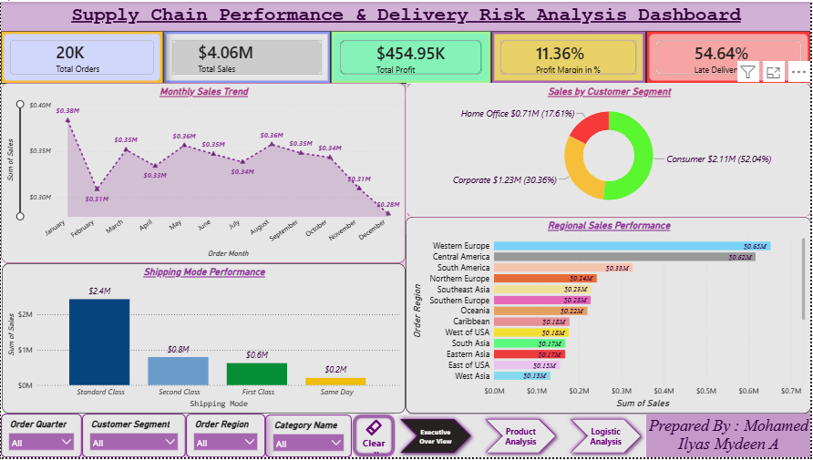
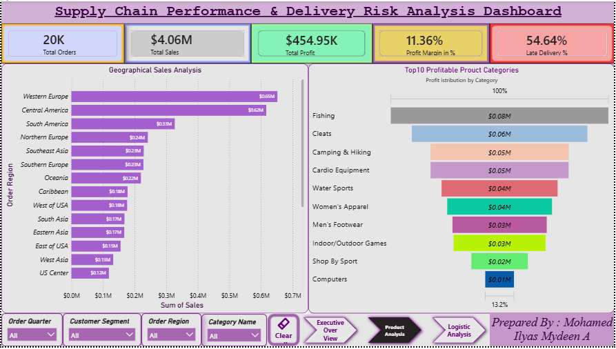
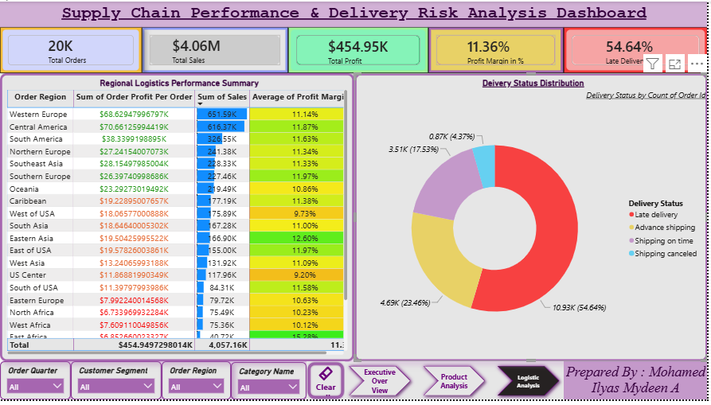

# 📊 Supply Chain Performance and Delivery Risk Analysis

## Overview

This project analyzes supply chain operations using Microsoft Excel and Power BI to identify sales trends, customer behavior, product profitability, shipping performance, and delivery risks.

The objective is to transform raw supply chain data into actionable business insights through data cleaning, exploratory data analysis (EDA), and interactive dashboard development.

---

## Business Objectives

- Analyze regional sales performance
- Identify profitable product categories
- Evaluate customer segment contribution
- Assess shipping performance and delivery risks
- Support business decision-making through interactive dashboards

---

## Dataset Information

| Attribute | Value |
|------------|---------|
| Domain | Supply Chain Analytics |
| Records | 19,999 |
| Columns | 37 |
| Tools | Excel, Power BI |

---

## Data Preprocessing

### Data Cleaning
- Removed unnecessary columns
- Checked duplicate records
- Handled missing values
- Standardized formats

### Calculated Columns
- Profit Margin %
- Order Month
- Order Quarter
- Order Year
- Delivery Delay Days

---

## Exploratory Data Analysis (EDA)

Performed analysis on:

- Sales by Region
- Profit by Category
- Sales by Customer Segment
- Shipping Mode Analysis
- Delivery Status Analysis
- Late Delivery Risk Analysis
- Monthly Sales Trend
- Top 10 Countries by Sales
- Profit Margin by Category

---

## Power BI Dashboard Features

### Executive Overview
- Total Sales KPI
- Total Profit KPI
- Total Orders KPI
- Profit Margin %
- Late Delivery %
- Monthly Sales Trend
- Regional Sales Performance
- Customer Segment Analysis
- Shipping Mode Analysis

### Product Analysis
- Top 10 Profitable Categories
- Geographical Sales Analysis

### Logistics Analysis
- Delivery Status Analysis
- Regional Performance Summary
- Delivery Risk Monitoring

---

## DAX Measures

```DAX
Total Sales =
SUM('Supply Chain'[Sales])

Total Profit =
SUM('Supply Chain'[Order Profit Per Order])

Total Orders =
COUNT('Supply Chain'[Order Id])

Profit Margin % =
DIVIDE([Total Profit],[Total Sales],0)

Late Orders =
CALCULATE(
    COUNT('Supply Chain'[Order Id]),
    'Supply Chain'[Late delivery risk] = 1
)

Late Delivery % =
DIVIDE([Late Orders],[Total Orders],0)
```

## Key Insights

### Executive Overview
- Total Sales reached 4.06 Million
- Total Profit reached 454.95 Thousand
- Consumer segment contributed over 52% of total sales
- Western Europe generated the highest revenue

### Product Analysis
- Fishing category generated the highest profit
- Cleats and Camping & Hiking were major contributors
- Product profitability is concentrated among top-performing categories

### Logistics Analysis
- Late deliveries account for 54.64% of total orders
- Standard Class generated the highest sales volume
- Significant opportunities exist to improve logistics efficiency

---

# Dashboard Screenshots

## Executive Overview



## Product Analysis



## Logistic Analysis



## Recommendations

- Improve shipping efficiency to reduce delivery delays
- Focus inventory planning on profitable categories
- Strengthen operations in high-performing regions
- Optimize logistics processes to improve customer satisfaction

---

## Technologies Used

- Microsoft Excel
- Microsoft Power BI
- DAX
- Data Cleaning
- Exploratory Data Analysis
- Dashboard Development

---

## Project Outcome

This project successfully transformed raw supply chain data into actionable business insights through data cleaning, analysis, and interactive dashboard development. The dashboard supports data-driven decision-making to improve profitability, customer satisfaction, and logistics performance.

---

## Author

**Mohamed Ilyas Mydeen A**

Aspiring Data Analyst | Excel | Power BI | Data Analytics | Generative AI

📧 LinkedIn Profile: https://www.linkedin.com/in/mohamed-ilyas-mydeen-a-b007b1411/
